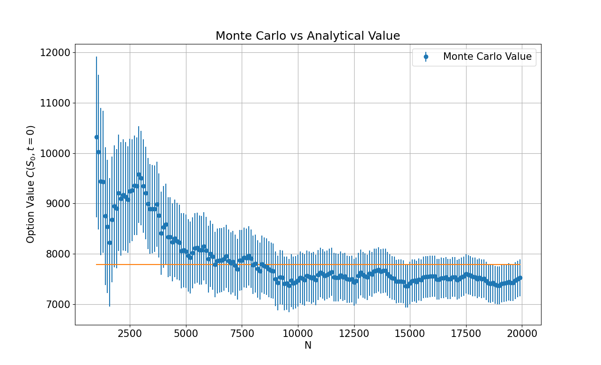
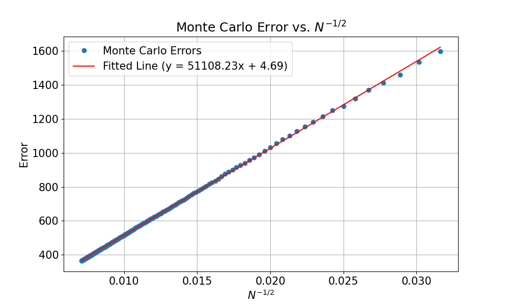
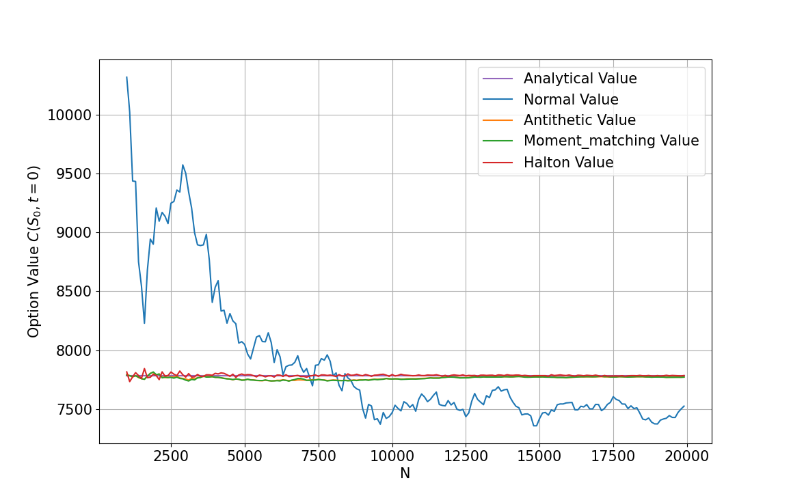
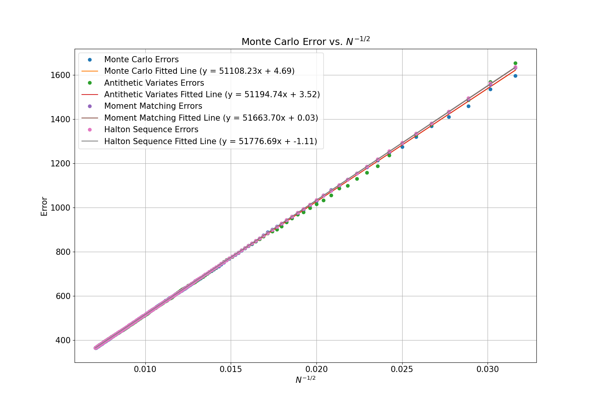

# Theory
## Stock Options

When the price of a stock is said to follow a risk-neutral distribution, we have that its price at a time $t$ is given by

$$ S_t \approx N(f(S_0,t), v^2(S_0, t)t) $$

where $S_0$ is the current stock price and $f(S_0,t)$ and $v(S_0,t)$ are functions calibrated for the specific context. For the financial contract to be valued in this report, the price at time $t$ is given by

$$S_t = S_0 (\cosh(2 \beta T - \alpha T)-1) + \theta (3-e^{\alpha T} - e^{\beta T}) + \sigma (1 + \alpha T) \frac{1}{2} (S_0 + \theta)^{\gamma} \sqrt{T} \phi$$

where $\theta=70100$, $\alpha=0.01$, $\beta=0.01$, $\gamma=1.05$, $\sigma=0.26$, $T=2$ and  $\phi = N(0,1)$.

If we consider a financial contract $C(S,T)$ written on the underlying stock $S$, which has a payoff given by

$$
    C(S,T) = g(S) = 
    \begin{cases} 
X_2 - S_T & \text{if } S_T < X_1 \\
S_T - X_2 & \text{if } X_1 \leq S_T < X_2 \\
X_1 - S_T & \text{if } S_T \geq X_2 
\end{cases}
$$

Then the analytical solution for any given payoff is given by the numerical integration

$$C(S_0, t=0) = \frac{e^{-rT}}{v \sqrt{2 \pi T}} \int_{-\infty}^{\infty} g(z) \exp  \left[ -\frac{(z-f)^2}{2v^2T} \right]  dz$$

We can carry out a Monte-Carlo valuation for the option by sampling from the normal distribution $\phi$ and calculating the stock price several times, with the $i^{th}$ stock price given by

$$S_T^i = f(S_0, T) + v(S_0, T) \sqrt{T} \phi_i$$

We then average over the $n$ calculated stock prices to approximate the value of the financial contract as

$$C(S_0, t=0) \approx e^{-rT} \frac{1}{n} \sum_{i=1}^{n} g(S_T^i)$$

## Path Dependent Options

Assuming that the risk-neutral stochastic process follows the SDE

$$ds = f(S,t)dt + v(S,t)dW.$$

A path-dependent option depends on all of the share prices, $S(t_k)$, at $K+1$ equally spaced sampling times $t_0, t_1,...,t_k=k \Delta t,..., t_K$ with $t_0=0$, $t_K=T$ and

$$\Delta t = \frac{T}{K}.$$

In this report, the SDE in equation (8) takes the specific form

$$ds = (\alpha \theta - \beta S)dt + \sigma (|S|)^{\gamma}dW,$$

where $\theta=70100$, $\alpha=0.01$, $\beta=0.01$, $\gamma=1.05$, $\sigma=0.26$, $T=1$.

Since the options are path-dependent, We must approximate the price at each of K time steps between the initial time and the time of maturity $T$. If the time step is given by $\Delta T$, then the share price at each discreet point in time is given by

$$S^i(t_k) = S^i(t_{k-1}) + f(S^i(t_{k-1}), t_{k-1}) \Delta t + v(S^i(t_{k-1}), t_{k-1})\sqrt{\Delta t} \phi_{i,k-1}$$

In this report, we value a minimum floating strike lookback call option, the payoff, $G$, is found by first calculating the minimum share price

$$A = \min_k S(t_k)$$

and then 

$$G(S,A) = \max(S-A, 0)$$

To calculate the value of the contract at $t=0$ using Monte Carlo simulation, we average over $n$ approximations and apply a discounting factor to get

$$C(S_0, t=0) \approx e^{-rT} \frac{1}{n} \sum_{i=1}^{n} G(S^i, A)$$

# Results
## Stock Options

The analytical solution to the value of the first financial contract was calculated from equation (5) using numerical quadrature using functions from the Python package SciPy. This value was found to be 7784.1000 with an error of 0.01661. Using a Monte-Carlo simulation, utilising equation (6), the value of the financial contract was found to be 7734.2 $\pm$ 51.6 when the number of simulated stock prices was $N=1000000$, in good agreement with the analytical solution. 

To investigate how the number of simulated stock prices affects the accuracy of the Monte-Carlo simulation, the value of the financial contract was calculated for a range of numbers of simulated stock prices $N$. Figure 1 below shows how the value of the financial contract converges to the analytical value with increasing $N$. 

As a result of the central limit theorem, the error of the Monte-Carlo simulation is expected to scale proportionally to $N^{-1/2}$. To demonstrate this, The plot in Figure 2 was created which shows the standard deviation against $N^{-1/2}$ and a linear fit was calculated to follow the relationship of $error = 51000N^{-1/2} + 4.99$. 

There exist a few methods by which the standard Monte-Carlo method can be improved that I investigated for this report. Firstly, Antithetic variables were used by calculating the stock price with the randomly sampled $\phi$ of equation (3) as well as its negative $-\phi$ to ensure the distribution is centred around zero. This is expanded upon by moment matching, in which each of the $\phi$ and $-\phi$ values sampled are divided by the square root of the variance of the entire sample to ensure the sample also has a variance of one. if $N$ values of $\phi$ are sampled for these two methods, the resulting final sample will have $2N$ samples. Finally, The Halton Sequence was used to create a set of coordinates $(x_1, x_2)$, uniformly distributed within the unit square. This process is started by selecting two prime numbers $a$ and $b$, before representing a series of numbers in the base $a^{-1}$ to give the $x_1$ values and $b^{-1}$ to get the $x_2$ values. A set of $2N$ normally distributed numbers can be created from $N$ $(x_1, x_2)$ coordinates using the Box-Muller method with the equations

$$y_1 = \cos(2 \pi x_2) \sqrt{-2 \log(x_1)}, \hspace{1mm} y_2 = \cos(2 \pi x_1) \sqrt{-2 \log(x_2)}$$

These three methods were compared to the original Monte-Carlo method by using them, in turn, to calculate the value of the financial contract for a range of values of $N$. The results of these simulations can be seen in Figure 3. It can be seen from Figure 3 that the introduction of the extra methods dramatically increases the efficiency of the Monte-Carlo simulations, with all three methods showing a similar level of improvement.

*Figure 1: A plot of the option value at t=0 for a range of values of the number of sample paths N, with error bars showing the standard deviation of the simulations run for each value of N.*

*Figure 2: A plot of the standard deviation of the option values against the reciprocal of the square root of the number of sample paths along with a linear fit.*

*Figure 3: A plot of the option value for a range of values of the number of sample paths N for the different Monte-Carlo techniques.*

Figure 4 shows a plot of the errors against $N^{-1/2}$ for each of the methods over a range of values of $N$. For each method, a linear fit has been calculated. All three improvement methods have very similar convergence rates, however, at small N, moment matching and Halton sequence methods slightly outperform the antithetic variables method. 

*Figure 4: A plot of the error for the option value against N^{-1/2} for the different techniques.*

I also investigated the difference in time taken for each of the Monte-Carlo methods to run for a range of values of N. As can be seen, the addition of Antithetic variables and Moment Matching doubled the time taken to complete the Monte-Carlo simulation, whilst the Halton method significantly increased the time taken.

\begin{table}[h!]
\begin{center}
\begin{tabular}{ |c|c|c|c|c| } 
\hline
N & Standard Time & Antithetic Time & Moment-Matching Time & Halton Time  \\
\hline
10000 & 0.400 & 0.770 & 0.772 & 4.466 \\ 
20000 & 0.788 & 1.565 & 1.534 & 9.681 \\ 
30000 & 1.169 & 2.419 & 2.411 & 15.13 \\ 
40000 & 1.619 & 3.263 & 3.376 & 20.33 \\ 
\hline
\end{tabular}
\caption{A table showing the time taken in seconds for each of the Monte-Carlo methods to run for a range of values of N.}
\end{center}
\end{table}

